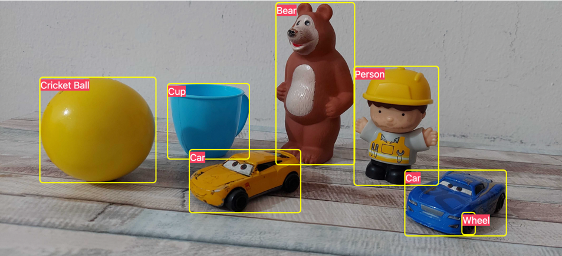

# Photo Inspect

  

Upload an image and detect the items/objects in that image in seconds.

## Pre-requisites to run this project

1. AWS credentials to use Amazon Rekognition

## Steps to run this project

1. Clone the repo
2. Run `npm install` to install all the dependencies
3. Create a `.env.local` from `env-example` file: `cp env-example .env.local`
4. Update the Keys/Tokens in the `.env.local` file
5. Run `npm run dev` to start the project

## Tech Stack:

- NextJS
- TailwindCSS
- Amazon Rekognition

## Contact

mohdejazsiddiqui@gmail.com